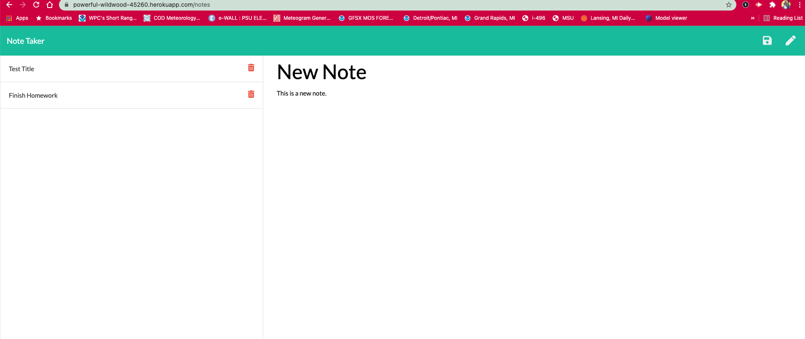

# Note Taker Server

## Links
Link to Heroku App: [Heroku Link](https://powerful-wildwood-45260.herokuapp.com/notes)

What the generated app looks like. 

<iframe src="https://drive.google.com/file/d/1m0d1sB6bgmqVzSBb8yFCjUcOsSK7O-M_/preview" width="640" height="480"></iframe>

## Summary
Building the back end server for the note-taker web application and and connecting it to the front end developed files and deploying the entire application to heroku for a fully functioning website. 

## Table of Contents
1. [Usage](#usage)
2. [Set Up](#set-up)
3. [What I Learned](#what-i-learned)
4. [Resources](#resources)

## Usage
Using Express.js as the backend to create a server that will save a retrieve data from a JSON database and then connecting the server to the frontend for a full working web application which is delployed on heroku which is linked above. 

The website has two html files linked that connect to different parts of the website. The first is the opening homepage and a second file that links to where the notes are written, saved, and deleted. 

## Set Up
This application is a complete application with both a fully functioning front end and back end. The server is set up using Express.js. The server.js file connects to the db.json file that stores and retrieves the notes for the website. 

The server also hosts the routes to the html, css, and index.js files so that the front end can connect to the backend. API routes are also created in the server file so notes can be stored and saved with the GET and POST methods.

The DELETE method was also added so that certain notes can be deleted. I used the npm nanoid package which is a unique string ID generator for javascript. This was used in the POST method as well to create id's for the notes so they could be called or deleted without deleting all the notes. The methods allowed the browser to send requests to the server which would respond with the approriate deleting or saving of the note. 

## What I Learned
Creating a fully functioning server was much more involved then origionally thought. The initial set up with a port to test the application was simple enough. The challenging portion of the homework for me was getting the notes to save and then being able to write a new note or recall an already saved note. The POST method was the most envolved with having to set up an id for the notes.

I ran into toruble in the index.js file in the renderActiveNotes function. On the web application after a note was saved if you clicked the pencil icon to create a new note the text field were not editable. I modified the if else statement within the renderActiveNotes function to fix the problem of not being able to write a new note. The if statement set the note title and note text fields to readonly and wouldn't allow the text fields to be modified. I had to remove the attribute in the else statement so that once the new note button was pushed a new note could be created. 

I'm not sure if there was another way around this problem that didn't involve modifying the front end, but this was the solution I came up with. 

I also ran into trouble deploying the application to heroku. I figured out that heroku was using it's own port not port 3000 which is what I had it set to. I changed the por
t to equal "process.env.PORT". I also had to tell heroku where to look for the server in the package.json file. Once I did this the application worked!  

## Resources
* [nom nanoid](https://github.com/ai/nanoid/)
* [npm express](https://www.npmjs.com/package/express)
* [npm path](https://nodejs.org/docs/latest/api/path.html) 
* [Express URL paramaters](https://www.digitalocean.com/community/tutorials/use-expressjs-to-get-url-and-post-parameters)